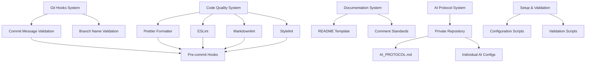

# Design Document

## Overview

The AI Collaboration Guidelines system implements a comprehensive framework for standardizing development practices in a multi-AI environment. The system consists of automated tooling for Git workflow enforcement, code quality management, documentation standards, and AI coordination protocols. The design emphasizes automation, consistency, and clear separation between public and private configurations.

## Architecture

### System Components



### Repository Structure

The system operates across two repositories:

- **Public Repository**: Contains code, public documentation, and tooling configurations
- **Private Repository**: Contains AI protocols, sensitive configurations, and private documentation

## Components and Interfaces

### 1. Git Workflow Enforcement

**Commit Message Validator**

- Validates against Conventional Commits standard
- Supports types: feat, fix, docs, style, refactor, test, chore
- Enforces format: `<type>(<scope>): <subject>`
- Integrates with Git pre-commit hooks

**Branch Name Validator**

- Enforces format: `<type>/<short-description>`
- Validates branch naming consistency
- Prevents invalid branch creation

### 2. Code Quality Management

**Prettier Integration**

- Configuration file: `.prettierrc`
- Supports: JavaScript, TypeScript, Markdown, CSS, HTML
- Auto-formatting on save and pre-commit
- Consistent formatting rules across all file types

**Linting System**

- ESLint for JavaScript/TypeScript
- Markdownlint for Markdown files
- Stylelint for CSS/SCSS files
- Configuration files: `.eslintrc.js`, `.markdownlint.json`, `.stylelintrc.json`

### 3. Documentation Standards

**README Template System**

- Standardized sections: Project Description, Installation, Usage, Contributing
- Automatic template generation for new projects
- Validation against required sections

**Comment Standards Enforcement**

- Focus on "Why" explanations rather than "What"
- Automated detection of low-quality comments
- Guidelines for meaningful documentation

### 4. AI Protocol Management

**Private Repository Structure**

```text
private-repo/
├── AI_PROTOCOL.md          # Core AI collaboration rules
├── ai-configs/
│   ├── CLAUDE.md          # Claude-specific configuration
│   ├── GEMINI.md          # Gemini-specific configuration
│   └── KIRO.md            # Kiro-specific configuration
└── security/
    ├── .env.example       # Environment variable template
    └── access-controls.md # Access control documentation
```

**AI Protocol Interface**

- Core protocol definition in `AI_PROTOCOL.md`
- Individual AI personality/role definitions
- Conflict resolution between core and individual protocols
- Security and access control guidelines

## Data Models

### Configuration Schema

```typescript
interface CollaborationConfig {
  git: {
    commitMessageFormat: string;
    branchNamingPattern: string;
    enforceConventionalCommits: boolean;
  };
  codeQuality: {
    prettier: PrettierConfig;
    eslint: ESLintConfig;
    markdownlint: MarkdownlintConfig;
    stylelint: StylelintConfig;
  };
  documentation: {
    readmeTemplate: string;
    commentStandards: CommentStandards;
  };
  aiProtocol: {
    privateRepoPath: string;
    coreProtocolFile: string;
    individualConfigsPath: string;
  };
}

interface ValidationResult {
  isValid: boolean;
  errors: ValidationError[];
  warnings: ValidationWarning[];
  suggestions: string[];
}
```

## Error Handling

### Git Hook Failures

- Clear error messages with specific fix instructions
- Fallback mechanisms for critical operations
- Logging of all validation attempts and results

### Code Quality Issues

- Detailed linting reports with line-by-line feedback
- Auto-fix capabilities where possible
- Integration with IDE/editor for real-time feedback

### Configuration Errors

- Validation of all configuration files on startup
- Default configuration generation for missing files
- Clear documentation for manual configuration fixes

### AI Protocol Conflicts

- Conflict detection between core and individual protocols
- Resolution guidelines and escalation procedures
- Audit trail for protocol changes

## Testing Strategy

### Unit Testing

- Individual validator functions
- Configuration parsing and validation
- Error handling scenarios

### Integration Testing

- End-to-end Git workflow testing
- Code quality pipeline testing
- Documentation generation testing

### Validation Testing

- Real-world commit message validation
- Code formatting consistency checks
- AI protocol compliance verification

### Performance Testing

- Git hook execution time optimization
- Large repository handling
- Concurrent AI agent operations

## Implementation Phases

### Phase 1: Core Infrastructure

- Git hooks setup
- Basic configuration management
- Prettier and ESLint integration

### Phase 2: Advanced Quality Tools

- Markdownlint and Stylelint integration
- Documentation standards enforcement
- Validation reporting system

### Phase 3: AI Protocol System

- Private repository integration
- AI protocol management
- Security and access controls

### Phase 4: Automation and Optimization

- Setup automation scripts
- Performance optimization
- Comprehensive validation suite
