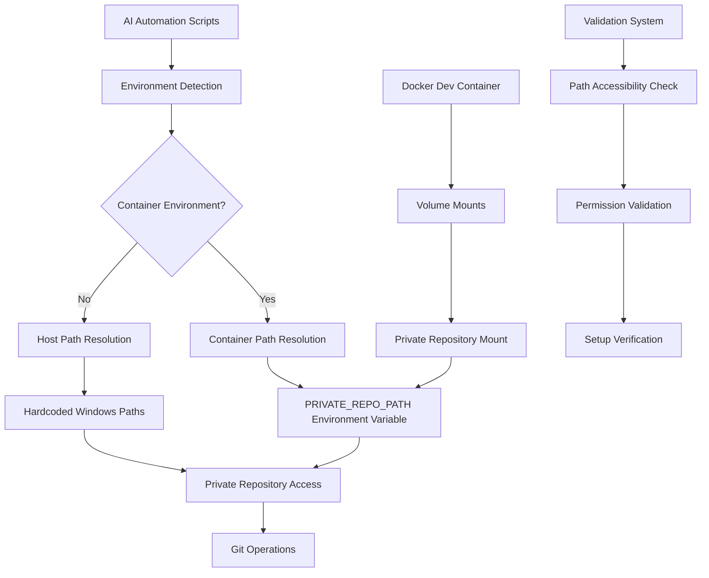

# Design Document

## Overview

This design implements Docker compatibility for the AI version control automation system by creating environment-aware path resolution and container configuration. The solution maintains backward compatibility with existing Windows-based workflows while enabling seamless operation within Docker development containers.

The core approach involves:

1. **Environment Detection**: Scripts automatically detect whether they're running in a container or host environment
2. **Dynamic Path Resolution**: A centralized path resolution system that adapts to the execution environment
3. **Container Configuration**: Docker dev container setup with proper mounts and environment variables
4. **Validation Framework**: Comprehensive validation to ensure proper setup and operation

## Architecture

### Component Overview



### Environment Detection Strategy

The system uses a multi-layered approach to detect the execution environment:

1. **Primary Detection**: Check for `PRIVATE_REPO_PATH` environment variable
2. **Secondary Detection**: Detect Docker-specific environment indicators
3. **Fallback**: Default to Windows host environment for backward compatibility

### Path Resolution Architecture

```javascript
// Centralized path resolution function
function getPrivateRepoPath() {
  // 1. Check for container environment variable
  if (process.env.PRIVATE_REPO_PATH) {
    return process.env.PRIVATE_REPO_PATH;
  }

  // 2. Check for Docker environment indicators
  if (isDockerEnvironment()) {
    throw new Error(
      "Docker environment detected but PRIVATE_REPO_PATH not set",
    );
  }

  // 3. Fallback to Windows path
  return "D:\\marskingx.github.io-dev-sync";
}
```

## Components and Interfaces

### 1. Environment Detection Module

**Purpose**: Detect execution environment and provide appropriate configuration

**Interface**:

```javascript
class EnvironmentDetector {
  static isDockerEnvironment(): boolean
  static isWindowsHost(): boolean
  static getPrivateRepoPath(): string
  static validateEnvironment(): ValidationResult
}
```

**Implementation Details**:

- Checks for Docker-specific environment variables (`/.dockerenv`, container-specific paths)
- Validates `PRIVATE_REPO_PATH` environment variable in container environments
- Provides fallback to Windows paths for host environments

### 2. Path Resolution Service

**Purpose**: Centralized path resolution for all AI automation scripts

**Interface**:

```javascript
class PathResolver {
  static getPrivateRepoPath(): string
  static resolvePrivateFile(relativePath: string): string
  static validatePath(path: string): boolean
  static getPrivateFilePatterns(): string[]
}
```

**Key Features**:

- Environment-aware path resolution
- Validation of path accessibility
- Consistent interface for all automation scripts

### 3. Docker Configuration Manager

**Purpose**: Manage Docker dev container configuration and validation

**Configuration Structure**:

```json
{
  "mounts": [
    {
      "source": "${localEnv:PRIVATE_REPO_HOST_PATH}",
      "target": "/workspace/private-repo",
      "type": "bind"
    }
  ],
  "containerEnv": {
    "PRIVATE_REPO_PATH": "/workspace/private-repo"
  },
  "remoteUser": "node"
}
```

### 4. Validation Framework

**Purpose**: Comprehensive validation of Docker compatibility setup

**Interface**:

```javascript
class DockerCompatibilityValidator {
  static validateContainerSetup(): ValidationResult
  static validatePrivateRepoAccess(): ValidationResult
  static validateGitOperations(): ValidationResult
  static generateDiagnosticReport(): DiagnosticReport
}
```

## Data Models

### Environment Configuration

```typescript
interface EnvironmentConfig {
  type: "docker" | "windows-host";
  privateRepoPath: string;
  isValidated: boolean;
  capabilities: {
    gitOperations: boolean;
    privateFileAccess: boolean;
    memorySync: boolean;
  };
}
```

### Validation Result

```typescript
interface ValidationResult {
  isValid: boolean;
  errors: ValidationError[];
  warnings: ValidationWarning[];
  recommendations: string[];
}

interface ValidationError {
  code: string;
  message: string;
  path?: string;
  resolution: string;
}
```

### Docker Mount Configuration

```typescript
interface DockerMountConfig {
  source: string; // Host path to private repository
  target: string; // Container mount point
  type: "bind" | "volume";
  consistency?: "consistent" | "cached" | "delegated";
}
```

## Error Handling

### Error Categories

1. **Environment Detection Errors**
   - Docker environment detected but no `PRIVATE_REPO_PATH` set
   - Invalid or inaccessible private repository path
   - Permission issues with mounted directories

2. **Path Resolution Errors**
   - Private repository path not found
   - Insufficient permissions for Git operations
   - Mount configuration mismatch

3. **Git Operation Errors**
   - Unable to access private repository
   - Authentication failures in container environment
   - File permission conflicts between host and container

### Error Handling Strategy

```javascript
class DockerCompatibilityError extends Error {
  constructor(code, message, resolution) {
    super(message);
    this.code = code;
    this.resolution = resolution;
    this.name = "DockerCompatibilityError";
  }
}

// Usage example
if (!fs.existsSync(privateRepoPath)) {
  throw new DockerCompatibilityError(
    "PRIVATE_REPO_NOT_FOUND",
    `Private repository not found at: ${privateRepoPath}`,
    "Check Docker mount configuration and ensure private repository exists on host",
  );
}
```

## Testing Strategy

### Unit Testing

1. **Environment Detection Tests**
   - Mock Docker environment variables
   - Test fallback to Windows paths
   - Validate error handling for invalid configurations

2. **Path Resolution Tests**
   - Test path resolution in different environments
   - Validate private file pattern matching
   - Test error scenarios and fallbacks

### Integration Testing

1. **Container Environment Tests**
   - Test full workflow in Docker container
   - Validate Git operations with mounted private repository
   - Test file permission handling

2. **Cross-Environment Tests**
   - Test migration from host to container environment
   - Validate backward compatibility with existing Windows workflows
   - Test error recovery scenarios

### Validation Testing

1. **Setup Validation Tests**
   - Test Docker mount configuration validation
   - Test private repository accessibility
   - Test permission validation

2. **Diagnostic Testing**
   - Test diagnostic report generation
   - Validate troubleshooting recommendations
   - Test error message clarity and usefulness

## Performance Considerations

### Docker Mount Optimization

1. **Mount Strategy**
   - Use bind mounts for private repository access
   - Consider using `cached` consistency for better performance on macOS
   - Exclude unnecessary directories from synchronization

2. **File System Performance**
   - Minimize file system operations in container
   - Use efficient Git operations
   - Cache path resolution results

### Resource Management

1. **Memory Usage**
   - Efficient path caching
   - Minimal environment detection overhead
   - Optimized validation processes

2. **I/O Optimization**
   - Batch file operations where possible
   - Use efficient Git commands
   - Minimize cross-mount file operations

## Security Considerations

### Container Security

1. **User Permissions**
   - Run container as `node` user instead of root
   - Proper file permission mapping between host and container
   - Secure handling of private repository access

2. **Mount Security**
   - Restrict mount access to necessary directories only
   - Validate mount paths to prevent directory traversal
   - Secure handling of environment variables

### Data Protection

1. **Private Repository Security**
   - Ensure private files remain private in container environment
   - Validate access controls for mounted directories
   - Secure Git credential handling in containers

2. **Environment Variable Security**
   - Secure handling of `PRIVATE_REPO_PATH` environment variable
   - Prevent exposure of sensitive paths in logs
   - Validate environment variable values
