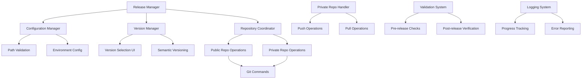
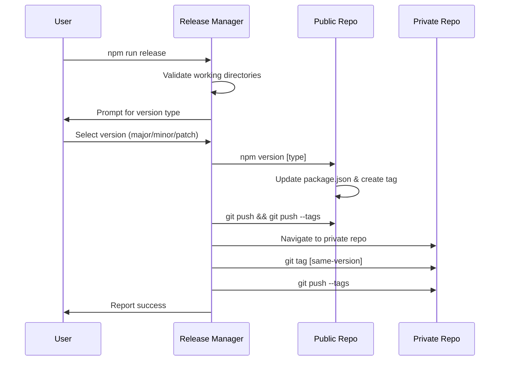

# Design Document

## Overview

The Dual Repository Release System provides automated coordination between a public code repository and a private configuration repository during version releases. The system ensures both repositories maintain synchronized version tags while preserving complete separation of public and private data. The design emphasizes atomic operations, comprehensive error handling, and user-friendly command interfaces.

## Architecture

### System Components



### Repository Interaction Model



## Components and Interfaces

### 1. Release Manager (`scripts/release-manager.js`)

**Core Responsibilities:**

- Orchestrates the entire release process
- Manages user interaction and prompts
- Coordinates between public and private repositories
- Handles error recovery and rollback scenarios

**Key Methods:**

```javascript
class ReleaseManager {
  async startRelease()
  async validatePreConditions()
  async promptVersionSelection()
  async executePublicRepoRelease()
  async executePrivateRepoSync()
  async handleRollback()
}
```

### 2. Configuration Manager

**Configuration Sources:**

- `.env` file for local development
- Environment variables for CI/CD
- Interactive prompts for first-time setup

**Configuration Schema:**

```javascript
{
  privateRepoPath: string,
  publicRepoPath: string,
  defaultCommitMessage: string,
  backupEnabled: boolean
}
```

### 3. Repository Coordinator

**Public Repository Operations:**

- Execute `npm version` with selected increment type
- Push commits and tags to remote
- Validate successful push operations

**Private Repository Operations:**

- Navigate to configured private repository path
- Create matching version tag
- Push tags to private remote
- Validate tag synchronization

### 4. Private Repository Handler (`scripts/private-repo-handler.js`)

**Push Operation:**

```javascript
async function pushChanges(commitMessage) {
  // Navigate to private repo
  // Execute: git add .
  // Execute: git commit -m [message]
  // Execute: git push
}
```

**Pull Operation:**

```javascript
async function pullChanges() {
  // Navigate to private repo
  // Execute: git pull
  // Report status
}
```

## Data Models

### Release Configuration

```typescript
interface ReleaseConfig {
  repositories: {
    public: {
      path: string;
      remote: string;
      branch: string;
    };
    private: {
      path: string;
      remote: string;
      branch: string;
    };
  };
  versioning: {
    strategy: "semantic";
    tagPrefix: "v";
  };
  operations: {
    atomicMode: boolean;
    backupBeforeRelease: boolean;
    validateAfterRelease: boolean;
  };
}
```

### Release State

```typescript
interface ReleaseState {
  currentVersion: string;
  targetVersion: string;
  versionType: "major" | "minor" | "patch";
  publicRepoStatus: "pending" | "success" | "failed";
  privateRepoStatus: "pending" | "success" | "failed";
  rollbackRequired: boolean;
  operations: ReleaseOperation[];
}

interface ReleaseOperation {
  id: string;
  type: "version" | "tag" | "push";
  repository: "public" | "private";
  status: "pending" | "running" | "success" | "failed";
  timestamp: Date;
  error?: Error;
}
```

## Error Handling

### Pre-release Validation Errors

- **Dirty Working Directory**: Clear instructions to commit or stash changes
- **Invalid Configuration**: Specific guidance for fixing configuration issues
- **Network Connectivity**: Retry mechanisms and offline mode suggestions
- **Permission Issues**: Clear instructions for resolving Git authentication

### Mid-release Failure Scenarios

- **Public Repo Success, Private Repo Failure**:
  - Log the successful public repo tag
  - Provide manual commands to sync private repo
  - Option to retry private repo operation
- **Network Interruption**:
  - Save release state
  - Provide resume functionality
  - Validate partial operations

### Rollback Procedures

- **Automated Rollback**: For operations that can be safely reversed
- **Manual Rollback Instructions**: Step-by-step commands for complex scenarios
- **State Recovery**: Restore system to pre-release state when possible

## Testing Strategy

### Unit Testing

- Configuration parsing and validation
- Version increment logic
- Git command execution
- Error handling scenarios

### Integration Testing

- End-to-end release process
- Cross-repository synchronization
- Error recovery workflows
- Configuration management

### Scenario Testing

- Clean release (happy path)
- Partial failure recovery
- Network interruption handling
- Invalid configuration scenarios
- Permission and authentication issues

### Performance Testing

- Large repository handling
- Network latency impact
- Concurrent operation safety

## Security Considerations

### Path Validation

- Prevent directory traversal attacks
- Validate repository paths exist and are Git repositories
- Ensure write permissions before operations

### Configuration Security

- Secure storage of sensitive paths
- Environment variable validation
- No hardcoded credentials or paths

### Operation Isolation

- Prevent cross-contamination between repositories
- Validate Git operations don't affect unintended files
- Atomic operations to prevent partial states

## Implementation Phases

### Phase 1: Core Infrastructure

- Basic release manager structure
- Configuration management system
- Simple version increment functionality

### Phase 2: Repository Coordination

- Public repository operations
- Private repository synchronization
- Basic error handling

### Phase 3: Advanced Features

- Interactive user interface
- Comprehensive error recovery
- Logging and progress tracking

### Phase 4: Robustness and Testing

- Comprehensive test suite
- Performance optimization
- Security hardening
