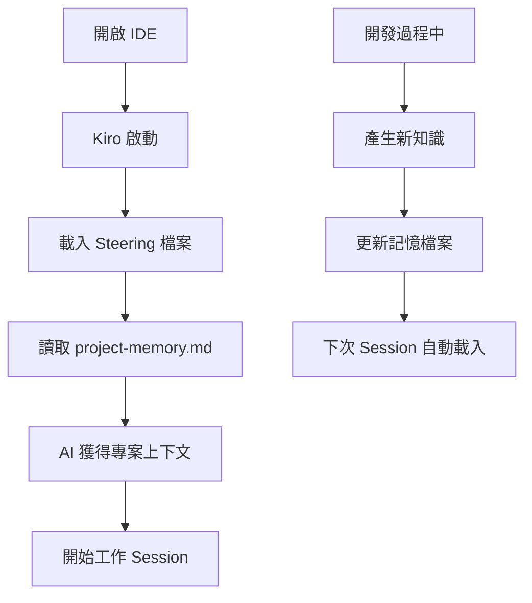

# 設計文件

## 概述

外部記憶系統是一個基於 Markdown 檔案的知識管理解決方案，專為「懶得變有錢」Hugo 部落格專案設計。系統透過 Kiro 的 steering 機制，在每次開啟 IDE 時自動載入專案記憶，為 AI 助手提供持續的上下文感知能力。

## 架構

### 核心組件

1. **記憶檔案 (Memory File)**
   - 位置：`.kiro/steering/project-memory.md`
   - 格式：結構化 Markdown
   - 功能：儲存專案的所有重要資訊和歷史脈絡

2. **Steering 配置**
   - 利用 Kiro 的 steering 機制自動載入記憶檔案
   - 確保每次新 session 都包含完整的專案上下文

3. **記憶管理工具**
   - 提供便捷的方式來更新和維護記憶檔案
   - 支援分類、搜尋和組織功能

### 系統流程



## 組件和介面

### 1. 記憶檔案結構

```markdown
# 專案記憶 - 懶得變有錢部落格

## 專案概述
- **專案名稱**: 懶得變有錢 (Lazytoberich)
- **技術棧**: Hugo + TailwindCSS + Hugoplate Theme
- **目標**: 財務規劃教育部落格
- **語言**: 繁體中文

## 重要決策記錄

### [日期] 決策標題
**背景**: 決策的背景和原因
**選項**: 考慮的各種選項
**決定**: 最終選擇和理由
**影響**: 對專案的影響

## 技術配置

### Hugo 配置
- 基礎 URL: https://marskingx.github.io/
- 時區: Asia/Taipei
- 預設語言: zh-tw
- 分頁: 120 篇文章

### 重要檔案位置
- 主題: themes/hugoplate
- 內容: content/
- 配置: hugo.toml
- 樣式: assets/scss/

## 學習筆記

### [主題] 學習內容
**問題**: 遇到的問題
**解決方案**: 採用的解決方法
**程式碼範例**: 相關程式碼片段
**參考資料**: 有用的連結和資源

## 最佳實踐

### 內容管理
- 文章放置在 content/blog/
- 使用 front matter 設定 SEO
- 圖片優化和 lazy loading

### 開發流程
- 使用 `npm run dev` 進行開發
- 使用 `npm run build` 建置產品版本
- Git 版本控制最佳實踐

## 常見問題和解決方案

### [問題類別] 問題描述
**症狀**: 問題的表現
**原因**: 問題的根本原因
**解決方法**: 具體的解決步驟
**預防措施**: 避免再次發生的方法

## 待辦事項和想法

### 短期目標
- [ ] 項目 1
- [ ] 項目 2

### 長期規劃
- [ ] 功能改進
- [ ] 效能優化

## 重要連結和資源

### 官方文件
- Hugo: https://gohugo.io/
- TailwindCSS: https://tailwindcss.com/
- Hugoplate: 主題相關文件

### 工具和服務
- Google Analytics: G-03PSTN4ES1
- 部署平台: GitHub Pages
```

### 2. Steering 配置

記憶檔案將透過 Kiro 的 steering 機制自動載入：

```markdown
---
inclusion: always
---

# 專案記憶載入

這個檔案包含了「懶得變有錢」專案的完整記憶和上下文資訊。

#[[file:project-memory.md]]
```

### 3. 記憶管理介面

提供以下功能來管理記憶檔案：

- **添加決策記錄**: 快速記錄重要技術決策
- **更新學習筆記**: 保存新學到的知識和解決方案
- **管理待辦事項**: 追蹤專案的短期和長期目標
- **搜尋功能**: 在記憶檔案中快速找到相關資訊

## 資料模型

### 決策記錄 (Decision Record)
```typescript
interface DecisionRecord {
  date: string;
  title: string;
  background: string;
  options: string[];
  decision: string;
  rationale: string;
  impact: string;
}
```

### 學習筆記 (Learning Note)
```typescript
interface LearningNote {
  topic: string;
  problem: string;
  solution: string;
  codeExample?: string;
  references: string[];
  tags: string[];
}
```

### 配置記錄 (Configuration Record)
```typescript
interface ConfigRecord {
  component: string;
  setting: string;
  value: string;
  reason: string;
  lastModified: string;
}
```

## 錯誤處理

### 檔案不存在
- 自動創建初始模板檔案
- 提供預設的專案結構和範例內容

### 檔案損壞
- 備份機制：保留歷史版本
- 驗證機制：檢查 Markdown 格式正確性
- 恢復機制：從 Git 歷史恢復

### 載入失敗
- 降級處理：提供基本的專案資訊
- 錯誤日誌：記錄載入失敗的原因
- 用戶通知：提醒用戶檢查記憶檔案

## 測試策略

### 單元測試
- 記憶檔案格式驗證
- Markdown 解析正確性
- 資料結構完整性

### 整合測試
- Steering 機制載入測試
- Kiro session 上下文驗證
- 檔案讀寫操作測試

### 使用者測試
- 記憶檔案可讀性測試
- AI 助手回應品質驗證
- 開發流程整合測試

### 效能測試
- 大型記憶檔案載入時間
- 搜尋功能回應速度
- 記憶體使用量監控

## 安全考量

### 敏感資訊保護
- 避免在記憶檔案中儲存密碼或 API 金鑰
- 使用環境變數參考替代實際值
- 定期審查記憶檔案內容

### 版本控制
- 記憶檔案納入 Git 版本控制
- 敏感資訊使用 .gitignore 排除
- 定期備份重要記憶內容

## 維護和擴展

### 定期維護
- 每月檢查和整理記憶檔案
- 歸檔過時的資訊
- 更新重要連結和參考資料

### 擴展性設計
- 支援多個記憶檔案分類
- 可配置的載入策略
- 插件化的記憶管理工具

### 效能優化
- 大檔案分割策略
- 索引和搜尋優化
- 快取機制實作