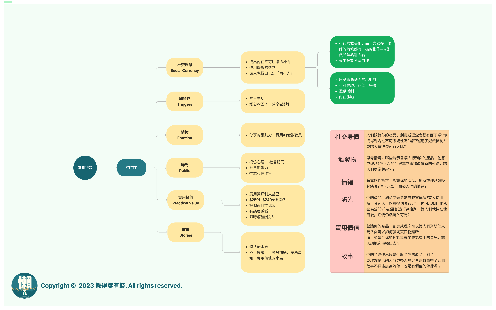

這本書算是我出社會的第一本理財書，十多年過去了，我還是覺得這是一本好書，作者勤奮工作，卻在中年覺悟，想致富不能靠薪水，因此痛下決心要學好投資與財務管理，他發展出一套結合財務知識與EXCEL試算表來檢驗報酬率的理財方法，並提早達到財務自由的目標。

作者觀察一般投資人有兩大類型，一種人只要想到可能的投資風險就怕，所以只會做定存，這些人的財富一定會因為通貨膨脹而縮水；另一種人則仰賴投資大師或投顧老師指點迷津，但因無法精準掌握進出時間而錯失機會。作者認為，不必等別人幫你分析，只要能讓數字說話，風險與機會一目了然，投資決策絕對不失誤。

在本書中，作者慷慨分享他精心研究與實務操作15年的個人投資理財心得，並提供15個免費下載的EXCEL試算表，除了個人、家庭財務規畫，還要教你看明白、算清楚市場中各種投資工具的價值與投資報酬率。只要你學會這樣算，一定可以穩健理財，一輩子都有錢。

---

## 噢，薪水，去死吧

當你領到你的薪水時，如果你沒分期的野蠻，那搞不好你有月光習慣。但是記得你的錢是朋友，不是仇人。所以請不要馬上衝去購物中心，像個野蠻人一樣瘋狂掏出信用卡就把錢給花光了。記住，你的薪水不是無底洞，而是一個月的開始。所以，先冷靜下來吧！

## 預算，是騙子！

現在，試著建立一個預算。將你的預期支出列成清單，這包括房租、食物、水電費、交通和其他必要開支。然後，計算一下這些開支的總和。這樣你就知道你有多少錢可以使用。

理財高手都教你建立預算？你怎麼可能真的照著預算走呢？天天都想買的東西。如果建立預算對你來說是痛苦的，不如就放棄吧。你可以選擇透過**目標式財務規劃**，完整的捨棄掉預算這個鬼東西。

不過書裡面還是有教到要編列預算的概念，如果能力許可，還是可以把自己的錢預算化，這是最理想的狀態。

## 抵押，不是房屋遊戲！

如果你是一個有幸擁有自己房子的人，恭喜你！但請不要把它當成一個賺錢的機會。不要貸款買更多的東西，以為可以通過抵押房屋來豪賭一把。記住，抵押不是一個遊戲，而是一個負擔。

房屋是一個可以增值的工具（理論上是這樣），透過房屋的增貸有機會在有把握的情況下來一場ＡＬＬ ＩＮ？

## 存錢，就是花錢

存錢可能聽起來不是很有趣，但它非常重要。設立一個緊急基金，這是用來應對突發事件的錢，負面的比如一個隨時出現的火災、地震、車禍、中共的飛彈，正面的也許突如其來的轟趴、或是朋友揪團要去吃大餐還是來個紅眼航班都有可能。把每個月的一小部分錢存到這個基金中，直到達到一個你感到安心的金額。

這跟買東西分期的概念完全是一模一樣，但會有錢的人就是跟你想的不一樣。

## 投資，不是賭博

投資是讓你的錢為你工作的一個方法。但是，這並不是說你應該把錢帶到賭場，把它們全押在紅色或黑色上。投資需要一些規劃和計劃，所以別急於投入，也不要盲目跟風。

投資這檔事你想的都是今天買進明天漲停，但有錢人想的都是錢躺在裡面工作，哪有叫他今天工作明天就離職的道理？

## 財務目標，不是玩笑

最後，設立一個長期儲蓄目標。這可以是為了退休、旅遊、或者實現其他財務目標。將每個月的一部分錢放入這個目標，並堅持下去。這不僅會幫助你實現夢想，還會讓你感到更有動力。

但這個目標通常你需要有人陪伴你一起執行（能夠有信賴且中立的顧問就是最好的選擇），而這個人通常都不會是你的家人，因為家人只會想著如何花掉你的錢。

## 懶的有結論

總之，理財可能聽起來很無趣，但它對於你的財務健康非常重要。所以，請記住這六個件事，並保持冷靜、預算、理性抵押、存錢、投資和設立儲蓄目標。這樣，你就能夠在未來的日子裡享受更多的笑聲，而不是錢包上的眼淚。希望這些財務規劃的六個點能讓你的理財之路更有趣！

回歸到我的初衷，沒有一個人的財務規劃會跟另外一個人一樣，即使是雙胞胎。因為財務規劃就跟每個人的ＤＮＡ一樣，是獨一無二的。也正因為如此，一昧的尋求最好的解決方法並不實際。最實際的還是**最舒服的生活方式**。

👉[透過更多地方收聽「懶得變有錢」Podcas](https://solink.soundon.fm/lazytoberich)

## 購書連結

## 更多我的書單

)

[查看書單](https://lazytoberich.com.tw/reading-list/)
