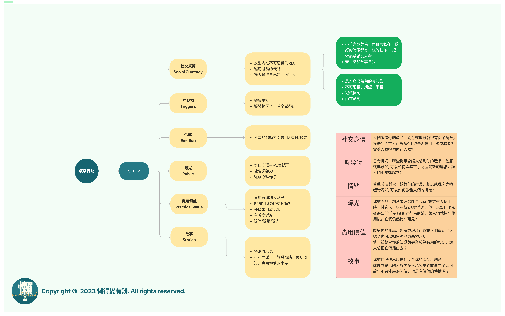

## 有錢才有機會自由

### 財務自由的七個步驟

1. 搞清楚你需要多少錢
2. 計算出你還差多少錢
3. 改變你對金錢的認知
4. 別再做預算了。重點是哪件事對你的儲蓄影響最大
5. 利用你的正職
6. 創造一個有利潤的副業並拓展你的收入來源
7. 盡可能地投資

## 時間比金錢珍貴

- 通膨是金錢無形的殺手，它無所不在，而且隨時都在伺機而動，讓你的錢變的沒有價值。
- 複利是金錢隱形的幫手，它無所不在，而且隨時都有伺機而動，讓你的錢變的更有價值。
- 人生在最精華的20-40歲還是需要工作，因為你需要許多的經歷與經驗幫助你的決策

## 你的財務自由數字是多少？

- 財務自由代表達成財務獨立，可以不完全需要為了錢工作，可以為了理想或是興趣找事情做。但你得先知道那是多少錢！
- 你的生活方式越貴，你的花費越高，需要的錢也就越多，這代表你可能需要工作的更久！
- 需求和欲望不一樣。很多人花了很多錢買不需要的東西，目的只是為了向他討厭的人炫耀。

### 讓錢用不完的５個方法

1. 存下年支出的25倍金額(其實真的存的到)
2. 延後提領你的投資報酬
3. 越接近退休年限，緊急預備金的金額要再放大
4. 如果真的完全只有投資收入，不要因為股市大漲而超額提領
5. 盡量不要動用到本金，因為本金是投資成長的來源

## 你現在有多少錢？

> 總資產－總負債－總淨值
> 

編成你的資產負債表，讓你的資產淨值一覽無遺的呈現給自己，不論你有多少個銀行帳戶，不論那個銀行帳戶有多少錢，盤點庫存是每一家公司的SOP，盤點資產也應該要是你財務規劃的SOP。

### 資產有正有負 如果是負債怎麼辦？

優先還掉利率高的負債，因為利率高的負債就是你現金流最大的敵人，複利是雙面刃，欠下的卡債利率通常效高，一定要優先償還。

### 管錢就是在管情緒

如果你有買過股票，你可能會有`「看見」你所買進的股票是虧損的狀態，或是獲利狀態。`然後你就會發現你被股票的漲跌影響了你的情緒，看見越賠越多就越怕賠更多，認賠殺出。看見越賺越多就希望它賺的更多，然後回到平盤或是轉為虧損。然後後悔不已。

> **你的投資沒有策略，都只有本能與情緒，你忘了只是「看見」而不是「實現」**
> 

### 變得有錢的日常習慣

- 常常思考怎麼賺錢
- 每天都關心一下你的錢
- 加深你與錢的關係（這點我是無法理解書裡面在講什麼）

## 快速累積財富

影響錢的３個因子

- 收入：賺多少
- 儲蓄：存多少
- 支出：花多少

### 善用正職的工作

受雇很難變有錢，但受雇可以確定會有錢。利用你的正職穩定的收入盡可能的在下班的時間換取更多業外的收入。如果你的業外收入是一個人就能達成，那就盡全力讓自己的收入變得更高。

### 擴大兼職收入

不論你的兼職收入是什麼，如果你開始有了員工，那就表示你的兼職收入步入正軌，可能開始能用一個人的薪資取代自己的工作內容並且還足夠有盈餘，那恭禧你，持續的放大它。

### 盡可能的開始投資

雖然說最賺錢的可能是本業，還有兼職的收入。也許這2個結合起來已經是你的事業，但別忘了，事業有可能有終止的一天（工作或是事業不再營運），此時需要依賴的就是儲蓄。然而盡早投資以及正確的投資是我們放大資產的方式之一。

> 複利的結果是你難以想像的
> 

## 十一個結帳前要做的思考

你每小時賺多少錢？先算出基礎工資！接著計算每小時的真實工資！認清自己每小時或是每天的生產價值。

十一個問題

1. 買這東西，可以讓我多快樂？
2. 要賺多少錢，才能買這個東西？
3. 我要用生命中的幾個小時去換這個東西？
4. 我買的起嗎？
5. 不看金額，改用百分比來看價格差異！
6. 有更便宜的嗎？能免費交換嗎？
7. 為求方便，我花了多少錢？
8. 這東西往後會花我多少錢？
9. 這東西在使用前的價值是多少？
10. 這些錢在未來值多少錢？
11. 這些錢能買到我未來多少時間？

## 設定預算

可能會帶來最大花費的項目，就要規劃預算來節制，先從前三大支出的項目開始吧！

1. 居住預算
    1. 租屋
    2. 水電
2. 交通預算
    1. 通勤
    2. 汽機車
3. 飲食預算
    1. 三餐
    2. 飲料

## 善用正職工作

- 最大化自己的價值
- 幫自己談加薪
    - 搞懂自己的市場價值（其它公司的薪水行情）
    - 弄清楚自己對公司而言有多少價值（幫公司賺多少錢，取代你的代價高嗎？）
    - 決定你要爭取多少額度與適當的開口時機
    - 開口
- 技能加上人脈等於金錢

## 展開賺錢的副業

- 兼職收入
    - 仍需要付出時間，但是有金錢收入的事。例如外送、直播或是司機工作。
- 被動收入
    - 投資收益、租金收益、不需要投入太多額外時間帶來的金錢。
- 如何投資該投入什麼副業？
    - 分析自己的熱情和技能
        - 有沒有什麼事情是你喜歡，而且能跟賺錢連結在一起？
    - 評估想投入副業的賺錢潛力

## 快速成功的投資策略５步驟

1. 短期與長期的投資目標
    1. 這裡的短期指的是５年內的財務目標，不是５天後的財務目標。
    2. 長期投資的財務目標會是在５年以上而且要預估到３０年。「買進」且「持有」
2. 你需要投資多少錢
    1. 把每個列出來的長期、短期財務目標做好計算並持續投資你的財務目標。
3. 決定目標的資產配置
    1. 長期目標也許波動可以大一些
    2. 短期目標盡量選擇波動小一點的資產
4. 評估拚資的費用，盡可能降低
5. 選擇正確的投資標的

## 不動產投資

台灣的不動產…自行評估

## 一輩子不缺錢：善用你的投資效益

真的不靠工作收入，就得依善投資收益。此時你應該要更斤斤計較你的資產淨值，由其是用來支撐退休後生活的投資帳戶價值，計劃好自己的生活支出，並且嚴守提領紀律。

## 四個增加理財成功的機會

1. 現在就開始你的財務規劃，並開始行動
    1. 開始比成功更重要。
2. 保持專注，學會說不
3. 持之以恆
    1. 每天
        1. 查看自己的資產淨值
        2. 每天存下一筆確定的錢或是買進一點資產
        3. 思考如何今天多賺1000塊的策略
        4. 檢查自己今天買的東西、花的錢。感受如何。
    2. 每周
        1. 檢查兼職收入與被動收入的表現狀況
        2. 檢查上周的信用卡刷卡的帳有沒有異常
        3. 檢查有沒有已支付但未顯示的帳
    3. 每月
        1. 檢視每月儲蓄的表現
        2. 至少增加1的儲蓄率
        3. 支付帳單(水、電、天然氣、信用卡、生活支出…等)
        4. 分析自己的現金流
        5. 調整下個月預接下來整年的預期現金流試算表
    4. 每季
        1. 檢查自己的財務自由數字的累積進度，且重新分析目標。
        2. 檢查自己的目標資產配置，有必要的話就請重新調整。
        3. 重新計算你每一項收入來源與綜合收入的每小時真實工資，並記錄在試算表裡。
        4. 利用免費服務檢查信用評分—檢查有沒有異狀，例如出現了不存在的債務，或是已經繳清但被列為延遲或尚未繳納的款項。
        5. 檢查被動與次要收入的表現。
    5. 每年（三小時）
        1. 檢視自動化投資與扣款項目。
        2. 準備好優化與最小化納稅額。
        3. 評估下一年的現金流與分析你對過去一年的評估。
        4. 檢視投資帳戶費用，確認收費沒有增加。
        5. 檢視每年訂閱的雜誌，串流服務與會員。
        6. 檢視年度贈與策略。
4. 分享知識，也了解何時應該請求幫助

## 懶得有結論


其實還在摸索如何寫出一篇好的讀書心得，感覺還需要再濃縮許多內容，這篇已經是2023年讀的書，不過內容還是跟想財富自由的人有關，好像就是在這本書的前後2年，自媒體就瘋狂出現了。

本書中最重要的核心：時間就是你的錢，你的錢是命換來的。


## 購書連結

