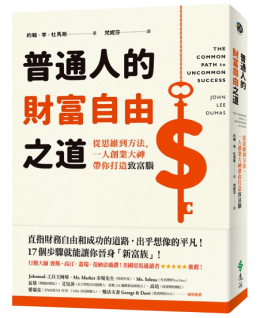
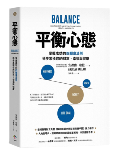
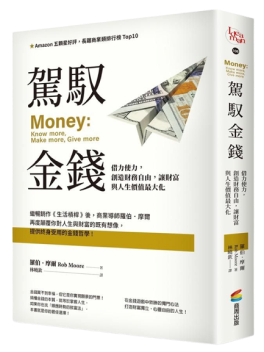
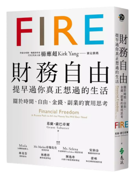
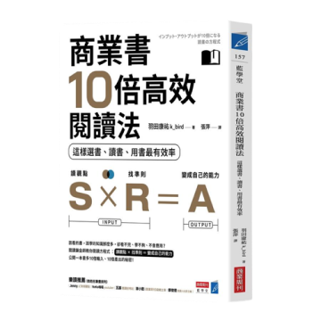

## 推薦書單(依閱讀時間序)
## 👇文末前往閱讀心得👇
| 閱讀書單 | 購書連結🌐 推薦評等⭐|
|-|-|
|  | ⭐⭐⭐     |
|  | ⭐⭐     |
|  | ⭐⭐⭐⭐⭐     |
|  | ⭐⭐⭐     |
|  | ⭐⭐⭐⭐     |
|  | ⭐⭐⭐     |
|  | ⭐⭐⭐     |
|  | ⭐⭐⭐⭐⭐     |
|  | ⭐⭐⭐⭐     |
|  | ⭐⭐⭐⭐⭐     |
|  | ⭐⭐⭐⭐     |
|  | ⭐⭐⭐⭐⭐     |
|  | ⭐⭐⭐⭐     |

##### 聯盟行銷聲明 網站部份文章含有聯盟連結，當你點擊連結購買產品後，我可能會收到少量回饋用以贊助本站營運。
## 👇文末前往閱讀心得👇