## 推薦書單(依閱讀時間序)
## 👇文末前往閱讀心得👇
| 閱讀書單 | 推薦評等 | 購書連結 |
|-|-|-|
| [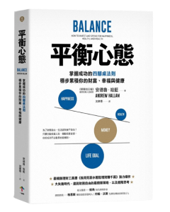](https://www.momoshop.com.tw/goods/GoodsDetail.jsp?i_code=11062008&Area=search&oid=1_1&cid=index&kw=%E5%B9%B3%E8%A1%A1%E5%BF%83%E6%85%8B&memid=6000021729&cid=apuad&oid=1&osm=league) | 《平衡心態》 ⭐⭐⭐⭐⭐ |    |
| [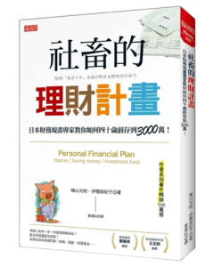](https://www.momoshop.com.tw/goods/GoodsDetail.jsp?i_code=9880572&Area=search&oid=1_1&cid=index&kw=%E7%A4%BE%E7%95%9C%E7%9A%84%E7%90%86%E8%B2%A1%E8%A8%88%E5%8A%83&memid=6000021729&cid=apuad&oid=1&osm=league) | 《社畜的理財計劃》 ⭐⭐⭐ |    |
| [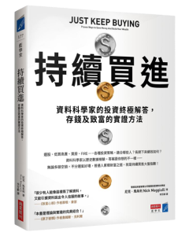](https://www.momoshop.com.tw/goods/GoodsDetail.jsp?i_code=11398962&Area=search&oid=1_1&cid=index&kw=%E6%8C%81%E7%BA%8C%E8%B2%B7%E9%80%B2&memid=6000021729&cid=apuad&oid=1&osm=league) | 《持續買進》 ⭐⭐⭐⭐⭐ |    |
| [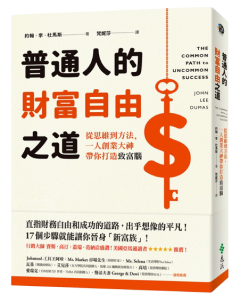](https://www.momoshop.com.tw/goods/GoodsDetail.jsp?i_code=9748520&Area=search&oid=1_1&cid=index&kw=%E6%99%AE%E9%80%9A%E4%BA%BA%E7%9A%84%E8%B2%A1%E5%AF%8C%E8%87%AA%E7%94%B1%E4%B9%8B%E9%81%93&memid=6000021729&cid=apuad&oid=1&osm=league) | 《普通人的財富自由之道》 ⭐⭐ |    |
| [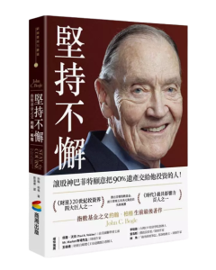](https://www.momoshop.com.tw/goods/GoodsDetail.jsp?i_code=9271410&Area=search&oid=1_1&cid=index&kw=%E5%A0%85%E6%8C%81%E4%B8%8D%E6%87%88%3A%E6%8C%87%E6%95%B8%E5%9F%BA%E9%87%91%E4%B9%8B%E7%88%B6%E7%B4%84%E7%BF%B0%EF%BC%8E%E6%9F%8F%E6%A0%BC&memid=6000021729&cid=apuad&oid=1&osm=league) | 《堅持不懈:指數基金之父約翰．柏格》 ⭐⭐⭐ |    |
| [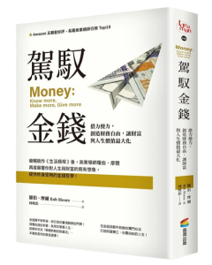](https://www.momoshop.com.tw/goods/GoodsDetail.jsp?i_code=12360259&Area=search&oid=1_1&cid=index&kw=%E9%A7%95%E9%A6%AD%E9%87%91%E9%8C%A2&memid=6000021729&cid=apuad&oid=1&osm=league) | 《駕馭金錢》 ⭐⭐⭐⭐⭐ |    |
| [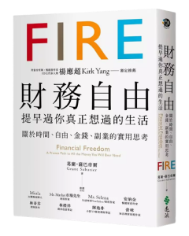](https://www.momoshop.com.tw/goods/GoodsDetail.jsp?i_code=8563268&Area=search&oid=1_1&cid=index&kw=%E8%B2%A1%E5%8B%99%E8%87%AA%E7%94%B1%20%E6%8F%90%E6%97%A9%E9%81%8E%E4%BD%A0%E7%9C%9F%E6%AD%A3%E6%83%B3%E9%81%8E%E7%9A%84%E7%94%9F%E6%B4%BB&memid=6000021729&cid=apuad&oid=1&osm=league) | 《財務自由 提早過你真正想過的生活》 ⭐⭐⭐⭐ |    |
| [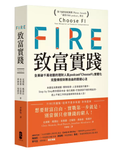](https://www.momoshop.com.tw/goods/GoodsDetail.jsp?i_code=10646848&Area=search&oid=1_2&cid=index&kw=FIRE%E8%87%B4%E5%AF%8C%E5%AF%A6%E8%B8%90&memid=6000021729&cid=apuad&oid=1&osm=league) | 《FIRE致富實踐》 ⭐⭐⭐ |    |
| [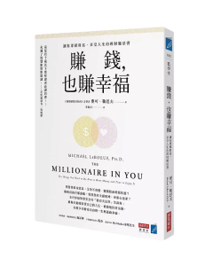](https://www.momoshop.com.tw/goods/GoodsDetail.jsp?i_code=12903375&Area=search&oid=1_3&cid=index&kw=%E8%B3%BA%E9%8C%A2%E4%B9%9F%E8%B3%BA%E5%B9%B8%E7%A6%8F&memid=6000021729&cid=apuad&oid=1&osm=league) | 《賺錢也賺幸福》 ⭐⭐⭐⭐⭐ |    |
| [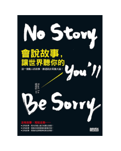](https://www.books.com.tw/exep/assp.php/shamangels/products/0010632833?utm_source=shamangels&utm_medium=ap-books&utm_content=recommend&utm_campaign=ap-202406) | 《會說故事讓世界聽你的》 ⭐⭐⭐ |   |
| [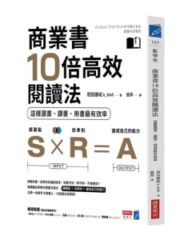](https://www.momoshop.com.tw/goods/GoodsDetail.jsp?i_code=10323246&Area=search&oid=1_1&cid=index&kw=%E5%95%86%E6%A5%AD%E6%9B%B810%E5%80%8D%E9%AB%98%E6%95%88&memid=6000021729&cid=apuad&oid=1&osm=league) | 《商業書10倍高效》 ⭐⭐⭐ |    |
|  | 《窮查理的普通常識》 ⭐⭐⭐ |    |
| [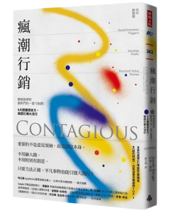](https://www.momoshop.com.tw/goods/GoodsDetail.jsp?i_code=8948985&Area=search&oid=1_1&cid=index&kw=%E7%98%8B%E6%BD%AE%E8%A1%8C%E9%8A%B7&memid=6000021729&cid=apuad&oid=1&osm=league) | 《瘋潮行銷》 ⭐⭐⭐ |    |
| [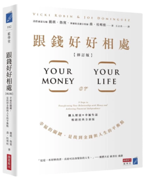](https://www.momoshop.com.tw/goods/GoodsDetail.jsp?i_code=11652919&Area=search&oid=1_1&cid=index&kw=%E8%B7%9F%E9%8C%A2%E5%A5%BD%E5%A5%BD%E7%9B%B8%E8%99%95&memid=6000021729&cid=apuad&oid=1&osm=league) |《跟錢好好相處》 ⭐⭐⭐ |    |
|  | 《第一次領薪水就該懂的理財方法》 ⭐⭐⭐ |    |
| [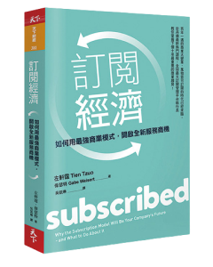](https://www.momoshop.com.tw/goods/GoodsDetail.jsp?i_code=8614079&Area=search&oid=1_1&cid=index&kw=%E8%A8%82%E9%96%B1%E7%B6%93%E6%BF%9F&memid=6000021729&cid=apuad&oid=1&osm=league) | 《訂閱經濟》 ⭐⭐⭐ |     |
||||

##### 聯盟行銷聲明 網站部份文章含有聯盟連結，當你點擊連結購買產品後，我可能會收到少量回饋用以贊助本站營運。
