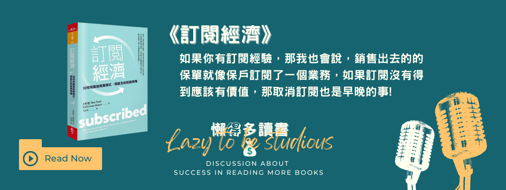

講到訂閱不外乎會提到[Netflix](https://www.netflix.com)、[Spotfy]((https://www.spotify.com))、AppleTV/Music…等等，但身為業務的你卻極需要打破傳統的業務框架，重新找回你全新的業務動力，因為你的客戶需要的不再是一份冰冷的保單，而是一個全新的服務。

## 小心緣故客戶很可能是你的絆腳石

銷售保單本身其是一件冷冰冰的事，不論前面做了多少熱枕的服務，保戶最後得到並且面對的只有一份單保合約，以及一期又一期的帳單。

> 事前不論再怎麼熱絡
> 

> 永遠免不掉事後不得己的冷落
> 

事前經常性的往來，為的是了解更多客戶的現況，厘清客戶的需求，透過這短期的往後需要快速的建立信任感並且成交。

成交過後客戶只要「沒理賠」「沒契變」，那也沒有需要討論任何保單的內容，就免不掉事後不得己的冷落。

## 信任是基礎，服務需升級

隨著時代的進步，資訊科技以及網路平台大大下降了現今客戶了解保險的門檻，過往的資訊落差不復存在，我們口中所謂的*「保險專業」*如今儼然成為了*「保險觀念」*。亦即人人都更可能了解自己有保險需求，人人都有更多機會學習保險知識。然後這些客戶要的不再只是「可信任」

在緣故客戶身上，我們擁有「時間」給我們最大的禮物：

> 基礎的信任感
> 

但在這個訊息量龐大到令客戶不容易消化的年代，越來越多的客戶需要的不是一個所謂「緣故、可信任」的業務員，而是能夠提供最快速的資訊、能夠令人感到安心、把選擇的權利還給保戶，卻又可以不斷的提供並且更新服務的業務員。

所以上網找尋自己不熟識的業務，要拒絕跟選擇的權利就在保戶自己手上，只要保戶能夠做足夠多的功能，業務員之前沒有更多的差異化，那對下個世代的保戶來說，選擇哪個業務的重點又會是什麼?

## 除了銷售保單，更需讓客戶感覺像是訂閱服務

談到訂閱制大家會直覺想到的就是「每個月」不斷的付費，那到底付出這個「月租費」或是「訂閱費用」的核心精神會是什麼呢?

手機的訊號，就是訂閱的「概念」，但僅有「概念」

> 讓你對訂閱有概念的日常行為：電信月租費
> 
> 
> *電信月租費就是每個月不斷付出的費用，而我們得到的就是「訊號」但是電信費用並不符合訂閱制的樣貌，因為他只能是「月租費」，對於我手上獲得的「無線訊號」是租用的概念。而非享有訂閱制的關鍵 — 服務。*
> 

## 客戶的保費，視為長期訂閱

你有看過Youtuber嗎?你有聽過直播主嗎?你曾經對「內容」付過費用嗎?

沒錯，內容經濟來臨的時代，別讓客戶買完保單就覺得業務員**不理不睬**，因為這個不理不睬是成交前的頻繁往來所帶來的落差。

但是除了「年月曆」每年更新之外，我們還更新了什麼服務內容呢?

當客戶沒理賠、沒契變的時候，我們又能做些什麼呢?

## 訂閱經濟一書能利用在保險業務的銷售策略

- **取得初期的成果**就好比一個初入保險業的新鮮人，你需要建立第一票的忠實客戶。
- **降低流失率**這些客戶不論購買與否，都一定要把握住可以不斷更新服務的機會。
- 透過向上銷售與交叉銷售增加價值書中的向上銷售與交叉銷售就有點像除了保險以外，怎麼樣可以提供更多元的服務內容，例如退休規劃、社會保險…等等的服務價值!
- 增加顧客成長的機會讓顧客成長這件事情就很有趣!如果你的客戶多數是上班族，有沒有什麼機會是可以讓他們增加收入的事可以提供呢?增加客戶的機會就是增加自己銷售的機會。更多延伸客戶如果是店家、企業主，我們有沒有相對應的人脈也一併擴充客戶的營收?

## 懶得有結論


訂閱經濟這本書也有一段時間了，但重新再讀過，總是可以再品嚐出一些什麼，每次到保險單位講課的時候，我時常直話直說真實的業務情境，但縱使不改變，我們仍然能夠創造出業績，創造出業績就代表我仍然有能力。

`改變是痛苦的，所以人們需要快樂!但快樂總是停留在過去。`



<iframe id="embedPlayer" src="https://embed.podcasts.apple.com/us/podcast/%E6%87%B6%E5%BE%97%E8%AE%8A%E6%9C%89%E9%8C%A2/id1707756115?itsct=podcast_box_player&amp;itscg=30200&amp;ls=1&amp;theme=auto" height="450px" frameborder="0" sandbox="allow-forms allow-popups allow-same-origin allow-scripts allow-top-navigation-by-user-activation" allow="autoplay *; encrypted-media *; clipboard-write" style="width: 100%; max-width: 660px; overflow: hidden; border-radius: 10px; transform: translateZ(0px); animation: 2s ease 0s 6 normal none running loading-indicator; background-color: rgb(228, 228, 228);"></iframe>

## 👉[透過更多地方收聽「懶得變有錢」Podcast](https://solink.soundon.fm/lazytoberich)