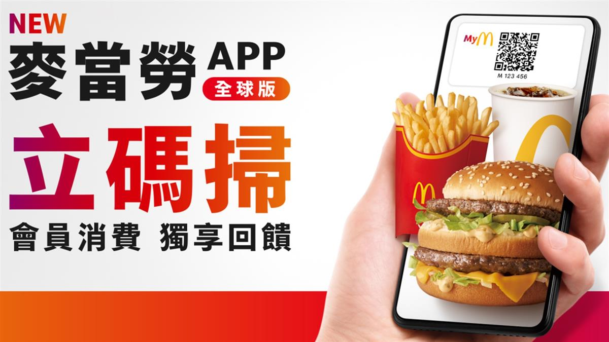
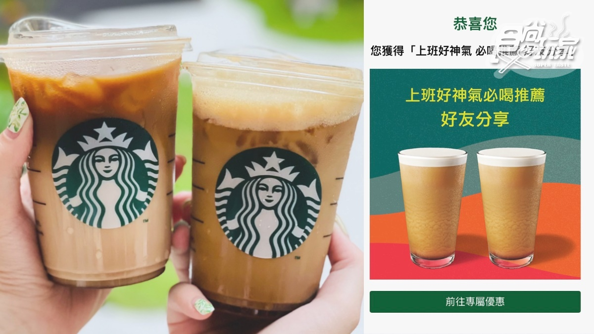
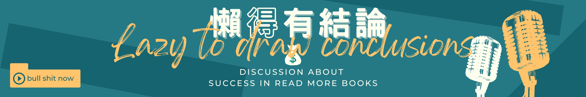

## **懶人提要**

各位想懶還不能懶以及不能懶但很像懶的懶粉們，今天我們來聊聊**[買一送一](https://www.businesstoday.com.tw/article/category/183030/post/202310260024/)**這個看似美好，但**[買一送一](https://www.businesstoday.com.tw/article/category/183030/post/202310260024/)**還是有不同的消費心理狀態。你以為隨便**[買一送一](https://www.businesstoday.com.tw/article/category/183030/post/202310260024/)**都是一種好事嗎?

### **麥當勞的買一送一：不只是食物，重點它算得上生理需求**

首先，我們來談談麥當勞。當你選擇麥當勞的[買一送一](https://www.businesstoday.com.tw/article/category/183030/post/202310260024/)，你不只是在買食物，你是在買時間和便利。這個選擇不僅解決了你的飢餓問題，還讓你的生活更有效率。幾乎沒有人覺得吃麥當勞是一種時尚、侈奢的樣態(不討論弱勢家庭看待麥當勞的態度)。這麼說來麥當勞的**[買一送一](https://www.businesstoday.com.tw/article/category/183030/post/202310260024/)**就是一種可以盡情消費的高CP表現!

### 連買個麥當勞都要這麼理性的嗎?靠，理財也太累了吧！

當然不是連買一個麥當勞就要這麼累！這裡想表達的是我們會買麥當勞**[買一送一](https://www.businesstoday.com.tw/article/category/183030/post/202310260024/)**重點還是在生理需求加上CP值的一種呈現。

不斷強調生理需求的原因是因為在馬斯克的需求理論裡面生理需求本來就是一種不可避免的需求。

### **星巴克：是超越生理需求的咖啡，也是社交象徵以及心理滿足**

接著，我們來看看星巴克。三不五時星巴克也會有買一送一的時候，但是你可以回想一下每一次去買星巴克的時候是不是心裡有一種好像賺到的感覺！畢竟咖啡是喝不飽的，那我們又為什麼一定要買星巴克買一送一，而不是CityCaffee寄杯買一送一呢？

你可能是在追求一種社交地位。每次你看到那個綠色的商標，你會不自覺地想到買一送一，偶爾的買一送一就會讓人心裡癢癢，但這真的值得嗎？從我的角度，喝星巴克比較像娛樂支出，而不是飲食支出啦！

### **買一送一，是快樂還是壓力？**

買一送一這個概念會觸發我們的某種情緒。對於麥當勞，那可能是滿足和安全感；對於星巴克，那可能是自豪或者壓力。這些情緒會影響我們的購買決策。

當然不會有買喝的東西的時候是一種壓力，但是你可以回想一下當今天辦公室的人都在揪星巴克買一送一的時候1杯120塊錢的飲料縱使買一送一還是需要60塊錢！這個時候如果收入高一點的人當然無所謂，但是從理財的角度來看1杯60塊錢的飲料他就不一定是必要性的支出或真的需求的支出，他可能就變成了你在辦公室社交上面的一種連結。

### **你跑去買一送一說明了什麼？**

當你在社交媒體上看到朋友們炫耀他們的買一送一，你會不會也想參一腳？這就是社會曝光和從眾效應在作祟。

之前我曾經分享過我在高鐵站看到一個正妹打破玻璃瓶的牛奶的故事，事情是這個樣子的，有一天我在高鐵站前面有一個短裙正妹迎面走過來就當我們擦身而過的時候匡啷一聲玻璃瓶掉在地上白色的液體灑滿一地，我連看都不用看就知道那個是Dr milk。所以當天早上我的早餐就變成了Dr.milk。

我們都會有被觸發的時候，就像在社群上面看到朋友都在曬麥當勞的買一送一，我們就也會跟風衝一波一樣。

(我今天也想吃麥當勞啦)

### **買一送一沒錯啊!但要建立在你的必要需求上**

想像一下，你走在街上，看到麥當勞和星巴克，兩家都有買一送一的優惠。你的選擇會反映出你的價值觀和生活方式。所以，選擇不只是買一送一，它是你生活的一部分。

## 懶得有結論


我知道有的時候消費很難理性，但就是因為很難理性所以理財才會很無聊，因為理財很無聊就很難有趣，所以大部分的人理財就會失敗。每次寫文章寫到很感慨的時候我就希望有多少人能夠接受這麼無聊的事情聽聽我的podcast，讓我陪你們一起走過這個無聊的時光，讓理財有趣一點。


<iframe id="embedPlayer" src="https://embed.podcasts.apple.com/us/podcast/%E6%87%B6%E5%BE%97%E8%AE%8A%E6%9C%89%E9%8C%A2/id1707756115?itsct=podcast_box_player&amp;itscg=30200&amp;ls=1&amp;theme=auto" height="450px" frameborder="0" sandbox="allow-forms allow-popups allow-same-origin allow-scripts allow-top-navigation-by-user-activation" allow="autoplay *; encrypted-media *; clipboard-write" style="width: 100%; max-width: 660px; overflow: hidden; border-radius: 10px; transform: translateZ(0px); animation: 2s ease 0s 6 normal none running loading-indicator; background-color: rgb(228, 228, 228);"></iframe>

## 👉[透過更多地方收聽「懶得變有錢」Podcast](https://solink.soundon.fm/lazytoberich)