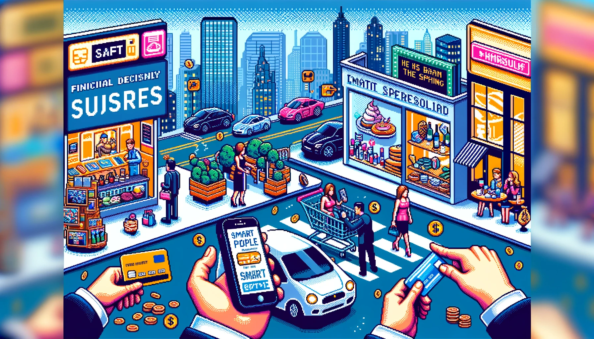

## **懶得變有錢情提要**

各位想懶不能懶以及不能懶但想懶的懶人們，理性聰明的你,工作事業可能還一帆風順,只是一但面對花錢這件事的時候,決策和選擇卻常常顯得盲目衝動。你明知要積極理財,存下足夠面對達來的緊急準備金以及退休金,也試過訂下嚴格消費預算，搞不好還想像自己有記帳強迫症，萬一沒記帳明天不要之吃飯之類的。但是執行時常常在不經思考的情況下，你的錢就還是超支了。原因其實在下面這5個角度:

## 習慣變成日常 養成自動花錢的模式

我們每天都在花費金錢,由吃喝拉撒睡生活起居，到交通工具的使用、職場生產力的提升，還有娛樂影音的訂閱等等。久而久之,我們就習慣了,直接養成了自動模式——拉出信用卡刷卡或打開行動支付掃QRCode成為下意識的反射動作。就像呼吸空氣一樣自然,不假思索。這正是最大的盲點所在。

我們必須意識到有意識的消費決策的這件事情的重要性。提醒自己在每一次花錢的時候花慢一點，審視每一次花錢之前的決策，如果再經過大腦層層過濾「必要、需要、想要」而不是單純的依賴直覺和習慣。這樣才能避免許多不必要的消費。

## 社交壓力 和期望驅使

當和朋友聚會吃飯或與客戶見面討論項目時，我們會在潛意識中基於社交期望而增加消費。比如認為自己點的菜不夠豪華精緻,就會覺得丟臉或失分，覺得請客的餐廳不夠高級，會不會讓對方覺得不夠誠意？

這種社交壓力和期望驅使,讓我們在不知不覺中超出了原先的消費計劃,花費更多預算外的金錢。其實我們大可不必在意他人眼光,要學會基於自身財力合理消費。如果不管誰約你，你都約去麥當勞就一切都安心了。

## 商業廣告 和銷售話術

各種促銷廣告、特惠活動以及店員的推銷會刺激我們的購買慾。當下話術和刺激促使我們快速作出購買選擇,回過神來才發現並不真正需要,或者超出了預算太多。這些都是商家精心設計的促銷策略,利用了人們在花錢決策時的漏洞。

所以我們必須提高警惕,學會理性看待這些外部引誘,理性思考自己是否真需要再次開銷,避免衝動和盲目消費。

## 生活步調趕 不上大腦

現代都市的生活節奏非常快,我們每天面臨的選擇數量之多,以及工作和生活的壓力之大,已經超過了人腦進化形成的天然範圍。缺乏時間和精力深入思考,我們只能依靠以往經驗和直覺反應來應對每一個決定。

所以當面對金錢問題時,我們傾向依賴舊有習慣,而非根據當下狀況進行理性判斷。衝動和盲目選擇引發的更多開支就不足為奇了。要解決這個問題,我們要學會放慢生活節奏,為每一次金錢決策保留足夠的思考時間。

## 消費融入 生活方方面面

我們吃的、喝的、住的、行的、玩的,消費已融入生活的方方面面。我們追求生活品質提升、娛樂和體驗的多元化。所以金錢支出項目早已不僅僅是減少飢餓和寒冷,更關乎生活的快樂程度。

當消費成為生活不可分割的一部分時,我們更看重當下的快樂和滿足,而不去考量這是否超出了合理預算,未來的生活是否能支撐得起。任由各種支出像空氣一樣理所當然地流逝,這正是理財的大忌。

## 懶得有結論


有的時候連我自己都會失去理性，由其是我面對飲料的時候，雖然有一陣子忍住不喝飲料的日子也習慣了，但是一但這個行為又出現，真的要停下來還真的是有一點難度。但話說回來，你有沒有覺得這種花錢花得很自然的感覺就像…大部份的人一但開了車，就會變成另外一個人的那種狀態。原本溫柔婉約的女子，上了車就變成材狼虎豹的樣子。差不多就是那種感覺，想要無有意識的控制自己禮讓，不要對路上的三寶或是龜速車發脾氣！是真的挺難的。當明白了這5大原因,希望你能正視自己盲目花錢的問題,讓每一次消費決策都經過深思熟慮,達到理性理財的目標。


<iframe id="embedPlayer" src="https://embed.podcasts.apple.com/us/podcast/%E6%87%B6%E5%BE%97%E8%AE%8A%E6%9C%89%E9%8C%A2/id1707756115?itsct=podcast_box_player&amp;itscg=30200&amp;ls=1&amp;theme=auto" height="450px" frameborder="0" sandbox="allow-forms allow-popups allow-same-origin allow-scripts allow-top-navigation-by-user-activation" allow="autoplay *; encrypted-media *; clipboard-write" style="width: 100%; max-width: 660px; overflow: hidden; border-radius: 10px; transform: translateZ(0px); animation: 2s ease 0s 6 normal none running loading-indicator; background-color: rgb(228, 228, 228);"></iframe>

## 👉[透過更多地方收聽「懶得變有錢」Podcast](https://solink.soundon.fm/lazytoberich)