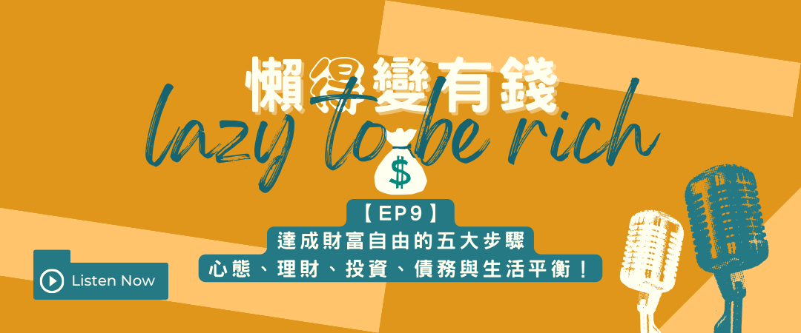

#懶得ㄉㄟˇ變有錢

## — 本集由 還沒有人 贊助播出—

🎧更多收聽連結在最下面

### — 本集內容 —

- 小孩要放電、大人要沉澱
- 建立錢能幫忙賺錢的心態
- 擁有基礎的財務預算
- 投資真的簡單，前提是你有原則
- 債務要積極管理
- 財富與自由你怎麼選擇？
- 需要你的5星評論與留言讓節目更有趣

節目中的相關文章連結：

* [【理財】達成財富自由的五大步驟：心態、理財、投資、債務與生活平衡！](https://lazytoberich.com.tw/p/read-booksafter-being-in-the-workforce-for-a-while-we-all-need-to-get-along-with-money-again./)
* [【嗑書】我們在出社會一陣子後，都需要重新《跟錢好好相處》](https://lazytoberich.com.tw/p/read-booksafter-being-in-the-workforce-for-a-while-we-all-need-to-get-along-with-money-again./)

懶得變有錢網站 🌍https://lazytoberich.com.tw

這些地方都有我 🌍https://linktr.ee/lazytoberich

[懶得變有錢fb](https://www.facebook.com/lazytoberich) 追蹤❤️ [@lazytoberich](https://www.facebook.com/lazytoberich)

[懶得變有錢ig](https://www.instagram.com/lazytoberich/) 追蹤❤️ [@lazytoberich](https://www.instagram.com/lazytoberich/)

—

👉[前往更多地方收聽「懶得變有錢」Podcast](https://solink.soundon.fm/lazytoberich)

## 懶得有結論


理財規劃不應該把理財放前面，規劃放後面。因為我們應該是要規劃理財、甚至做到「規劃不理財」那才是真正的理財的最高境界。


<iframe id="embedPlayer" src="https://embed.podcasts.apple.com/us/podcast/%E6%87%B6%E5%BE%97%E8%AE%8A%E6%9C%89%E9%8C%A2/id1707756115?itsct=podcast_box_player&amp;itscg=30200&amp;ls=1&amp;theme=auto" height="450px" frameborder="0" sandbox="allow-forms allow-popups allow-same-origin allow-scripts allow-top-navigation-by-user-activation" allow="autoplay *; encrypted-media *; clipboard-write" style="width: 100%; max-width: 660px; overflow: hidden; border-radius: 10px; transform: translateZ(0px); animation: 2s ease 0s 6 normal none running loading-indicator; background-color: rgb(228, 228, 228);"></iframe>

[https://embed.podcasts.apple.com/us/podcast/%E6%87%B6%E5%BE%97%E8%AE%8A%E6%9C%89%E9%8C%A2/id1707756115?itsct=podcast_box_player&itscg=30200&ls=1&theme=auto](https://embed.podcasts.apple.com/us/podcast/%E6%87%B6%E5%BE%97%E8%AE%8A%E6%9C%89%E9%8C%A2/id1707756115?itsct=podcast_box_player&itscg=30200&ls=1&theme=auto)

## 👉[透過更多地方收聽「懶得變有錢」Podcast](https://solink.soundon.fm/lazytoberich)