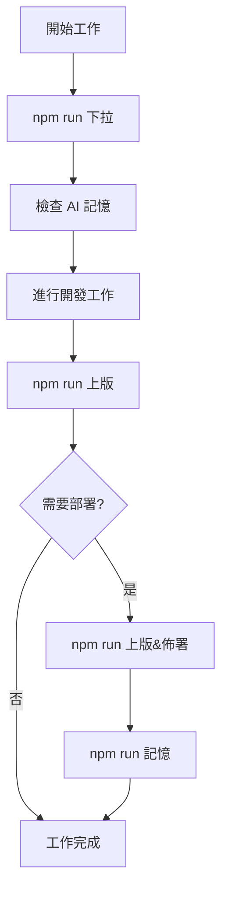

# 智能版控工作流程指南

日常開發與多 AI 協作的標準工作流程。

## 🎯 核心工作流程

### 📋 日常開發流程



#### 1. 工作開始前
```bash
# 拉取最新變更
npm run 下拉

# 檢查 AI 記憶狀態
npm run ai:memory

# 檢查潛在衝突
npm run conflict:check
```

#### 2. 開發過程中
- 隨時檢查系統狀態: `npm run test:system`
- 驗證代碼品質: `npm run lint:all`
- 分析效能影響: `npm run perf:analyze`

#### 3. 提交發布
```bash
# 智能提交 (僅本地)
npm run 上版

# 智能發布 (含部署)
npm run 上版&佈署

# 記錄協作日誌
npm run 記憶
```

## 🤖 多 AI 協作流程

### AI 分工架構
- **Claude**: 主要開發、修復、版本管理 (main 分支)
- **Codex**: 程式碼生成、重構、自動化腳本 (codex-dev 分支)  
- **Gemini**: 實驗功能、分析、內容創新 (gemini-dev 分支)

### 協作前檢查
```bash
# 檢查所有 AI 狀態
npm run ai:status

# 檢查記憶同步狀態
npm run memory:sync

# 檢查衝突風險
npm run ai:conflicts
```

### Worktree 工作流程

#### Claude (主分支)
```bash
# 位置: D:/marskingx.github.io
cd D:/marskingx.github.io

# 日常工作
npm run 下拉              # 拉取更新
# ... 進行開發 ...
npm run 上版              # 智能提交
npm run 上版&佈署          # 發布部署
npm run 記憶              # 記錄日誌
```

#### Codex (分支開發)
```bash
# 位置: D:/marskingx-worktrees/codex-dev  
cd D:/marskingx-worktrees/codex-dev

# 工作流程
git fetch origin main
git rebase origin/main    # 同步主分支
# ... 進行開發 ...
git add .
git commit -m "feat: 新功能描述"
git push --force-with-lease origin codex-dev
```

#### Gemini (實驗開發)
```bash
# 位置: D:/marskingx-worktrees/gemini-dev
cd D:/marskingx-worktrees/gemini-dev

# 實驗流程
git fetch origin main
git rebase origin/main    # 同步主分支
# ... 實驗開發 ...
git add .
git commit -m "experiment: 實驗功能描述"
git push --force-with-lease origin gemini-dev
```

### 分支合併流程
```bash
# 1. 功能完成確認
npm run test:system
npm run schema:validate

# 2. 切換到主分支
git checkout main
git pull origin main

# 3. 合併功能分支
git merge --no-ff feature-branch

# 4. 發布更新
npm run 上版&佈署
npm run 記憶
```

## 📊 版本管理流程

### 5碼版本號系統
- **格式**: `major.minor.patch.content.log`
- **第5碼**: AI 協作日誌版本

### 版本升級決策樹
```
重大架構變更 -> npm run version:major
新功能開發   -> npm run version:minor  
錯誤修復     -> npm run version:patch
內容更新     -> npm run version:content
AI 協作記錄  -> 自動遞增第5碼
```

### 版本發布檢查清單
- [ ] 系統測試通過: `npm run test:system`
- [ ] 結構驗證通過: `npm run schema:validate`  
- [ ] 效能分析正常: `npm run perf:analyze`
- [ ] 圖片優化完成: `npm run images:analyze`
- [ ] 代碼品質檢查: `npm run lint:all`
- [ ] AI 記憶同步: `npm run memory:sync`

## 🔄 衝突解決流程

### 預防措施
```bash
# 工作前檢查
npm run conflict:check

# 提交前驗證  
npm run conflict:precommit

# 檢查協作規則
npm run conflict:rules
```

### 衝突處理
```bash
# 1. 發現衝突
git status

# 2. 手動解決衝突
# 編輯衝突檔案...

# 3. 標記解決
git add 解決的檔案

# 4. 繼續操作
git rebase --continue
# 或
git commit
```

### 高風險檔案處理
對於 `hugo.toml`, `package.json`, `CLAUDE.md` 等高風險檔案：

```bash
# 協作前鎖定
npm run conflict:lock 檔案名

# 協作後解鎖  
npm run conflict:unlock 檔案名
```

## 📁 檔案責任區域

### 優先權分配
```yaml
/content/blog/:           內容創建者優先
/layouts/:               Claude 主導，其他協助  
/scripts/:               Codex 主導
/themes/hugoplate/:      需三 AI 協議
配置檔案:                Claude 統一管理
/static/:                共同維護
/assets/:                共同維護
```

### 檔案分類自動化
智能發布系統會自動區分：
- **公有檔案**: 網站建置必要檔案 → GitHub 公開庫
- **私有檔案**: AI 記憶、IDE 設定、日誌 → 本地私有庫

## 🚀 部署流程

### 自動部署 (推薦)
```bash
npm run 上版&佈署
```
系統會自動：
1. 智能分類檔案
2. 提交到對應儲存庫  
3. 觸發 GitHub Pages 部署
4. 記錄部署日誌

### 手動部署
```bash
# 1. 建置專案
npm run build

# 2. 驗證建置
npm run schema:validate
npm run perf:analyze

# 3. 推送部署
npm run push

# 4. 記錄日誌
npm run 記憶
```

## 🧠 記憶管理流程

### AI 記憶同步
```bash
# 檢查記憶狀態
npm run ai:memory

# 同步記憶檔案
npm run memory:sync

# 檢查目錄結構
npm run memory:structure
```

### 協作日誌記錄
每次完成重要工作後：
```bash
npm run 記憶
```

系統會自動：
1. 更新 `docs/aimemory/shared/ai-shared.md`
2. 記錄任務摘要、變更檔案、狀態
3. 遞增版本號第5碼
4. 推送到私有儲存庫

## ⚠️ 注意事項

### 禁止操作
- ❌ 直接使用 `git add . && git commit`
- ❌ 跳過智能發布系統
- ❌ 修改他人專責區域檔案
- ❌ 未協議修改高風險檔案

### 最佳實踐  
- ✅ 使用中文暗號指令
- ✅ 定期記錄協作日誌
- ✅ 工作前檢查衝突風險
- ✅ 遵循檔案責任區域
- ✅ 保持記憶檔案同步

## 🆘 緊急狀況處理

### 系統測試失敗
```bash
npm run test:system:verbose  # 詳細診斷
# 根據報告修復問題
npm run test:system         # 重新測試
```

### 部署失敗
```bash
npm run smart:analyze       # 分析檔案狀態
npm run conflict:check      # 檢查衝突
npm run memory:status       # 檢查私有庫狀態
```

### 記憶檔案損毀
```bash
npm run memory:structure    # 檢查結構
npm run memory:clean        # 清理損壞檔案
npm run memory:sync         # 重新同步
```

---

*智能版本控制系統 v5.0 - 工作流程指南*